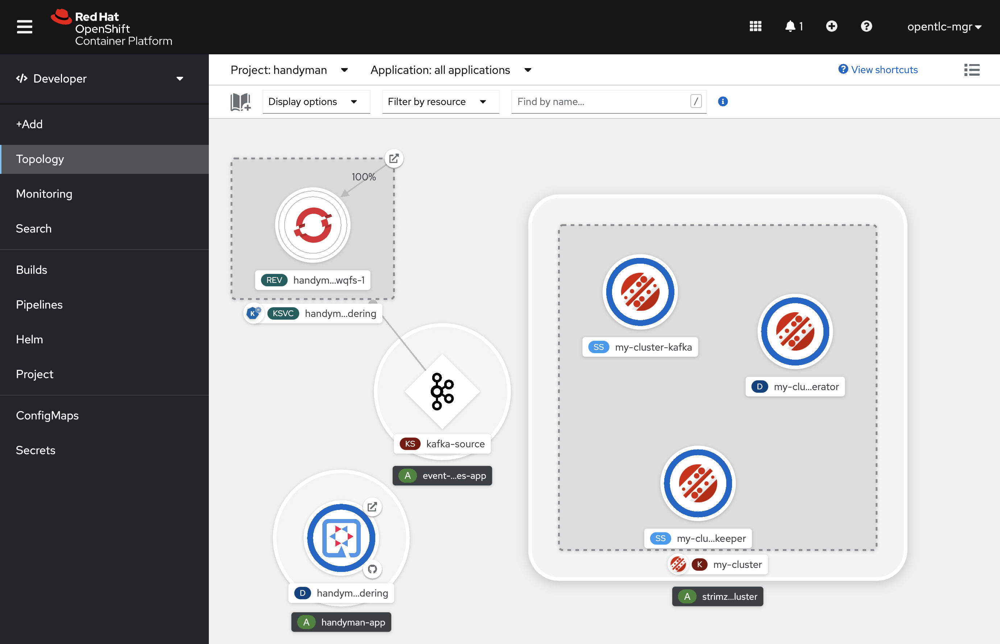
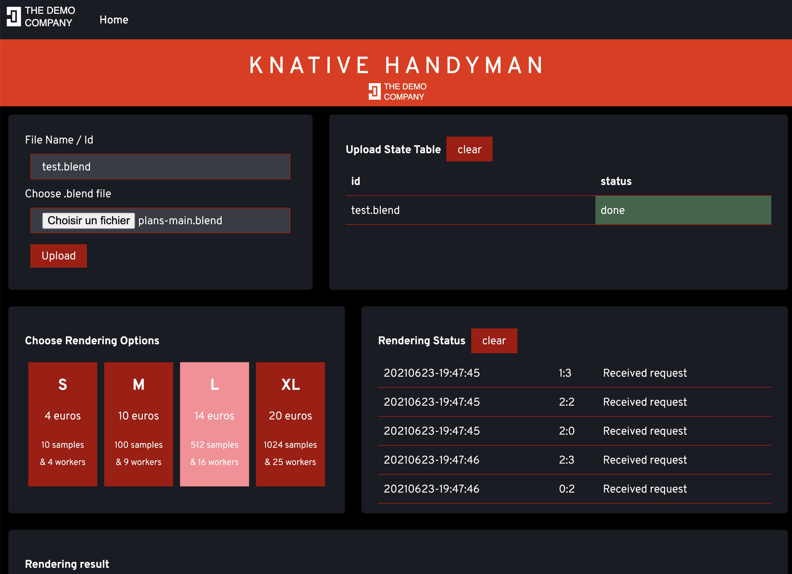
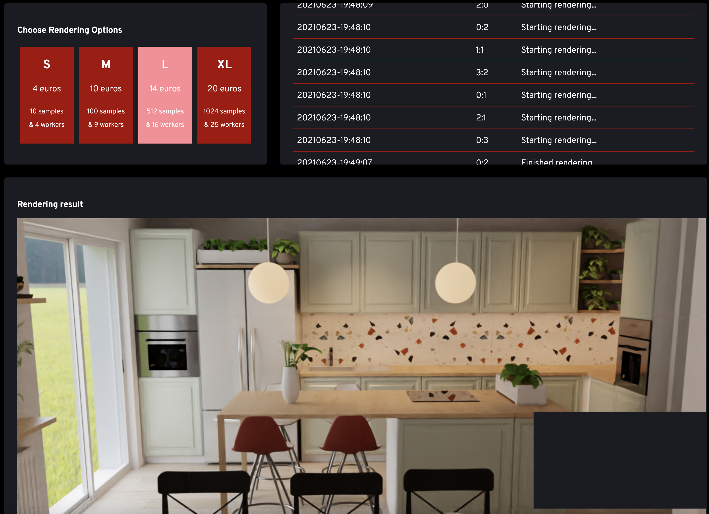

# knative-handyman

## What is it?
## Installation
### Deploy required Operators

> This demonstration has been created on OpenShift version 4.7 and recently updated to OpenShift 4.9+. If you stick with OpenShift 4.7 for now, check the manifests placed in `/manifests/openshift-4.7` folder for specific resources versions.

This demonstration has been tested on OpenShift version 4.9. In order to deploy it, you'll need the AMQ Streams/Strimzi.io
operator as well as the OpenShoft Serverless/Knative operator. Start installing these operators for the whole cluster:

```shell
oc create -f manifests/amq-streams-og.yml
oc create -f manifests/openshift-serverless-og.yml

oc create -f manifests/amq-streams-operator-subscription.yml
oc create -f manifests/serverless-operator-subscription.yml
```

### Install infrastructure

Wait until `knative-serving` and `knative-eventing` projects are created after operators installation and then install the
serverless infrastructure, enabling Knative serving, Knative eventing as well as Kafka event source addition:

```shell 
oc create -f manifests/knative-serving.yml -n knative-serving
oc create -f manifests/knative-eventing.yml -n knative-eventing
oc create -f manifests/knative-kafka.yml -n knative-eventing
```

Now we should be able to deploy Kafka brokers in a brand new `handyman` project:

```shell
oc new-project handyman
oc create -f manifests/kafka-cluster.yml -n handyman
oc create -f manifests/kafka-topics.yml -n handyman
```

> You'll see that the `rendering-requests` Kafka Topic is created with a number of 25 partitions that is matching with the
maximum number of rendering workers we may have (5 x 5 tiles image).

> Attention: you'll see that the rendering components are using a quite important amount of resources (4 cpu + 4.5 GB memory) be
sure to have raised the Quotas or LimitRanges of your project accordingly.  

### Deploy application components

Now start deploying the application components. We start with the `handyman-ordering` pod using a regular deployment, service and route:

```shell
oc create -f manifests/handyman-ordering-deployment.yml -n handyman
oc create -f manifests/handyman-ordering-service.yml -n handyman
oc create -f manifests/handyman-ordering-route.yml -n handyman
```

Then we'll deploy the `handyman-rendering` component, wrapping it into a Knative Service. For that, we use the `kn` CLI. We have used following version
of the CLI:

```shell
$ kn version
Version:      v20201110-e8b26e18
Build Date:   2020-11-10 10:39:27
Git Revision: e8b26e18
Supported APIs:
* Serving
  - serving.knative.dev/v1 (knative-serving v0.18.0)
* Eventing
  - sources.knative.dev/v1alpha2 (knative-eventing v0.18.0)
  - eventing.knative.dev/v1beta1 (knative-eventing v0.18.0)
```

Then we create the Knative service using the rendering container image:

```shell
kn service create handyman-rendering --image docker.io/alainpham/rendering:latest \
    --env FILESERVERURL=handyman-ordering:8080/download/ --env UPLOADSERVERURL=handyman-ordering:8080/renders/ \
    --env KAFKABROKER=my-cluster-kafka-bootstrap:9092 --env JAVA_OPTIONS=-Xmx3g --env QUARKUS_HTTP_READ_TIMEOUT=60m \
    --port 8083 --request cpu=4000m,memory=4500Mi --limit cpu=4000m,memory=4500Mi \
    --concurrency-limit 1 --concurrency-target 1 -n handyman
```

> You'll notice that we use a fair amount of resources. Also, note the concurrency-limit and target flags ensuring that each
rendering pod will only receive and process 1 rendering request at a time.  

Final step is now to deploy the Knative Kafka `EventSource`:

```shell
oc create -f manifests/kafka-source.yml -n handyman
```

Wait for some seconds and you should have the following topology view on the developer console:



## Runnning the demo

Connect to the route of `handyman-ordering` component and upload a Blender file to the application:



You'll have the ability to choose from different rendering options. Once clicked the requests are distributed among the
different `handyman-redenring` instances created by Knative eventing.

Depending on the chosen option, results are starting to appear after 30 seconds to 2 minutes.
The scene tiles are aggregated in the browser canvas view:

